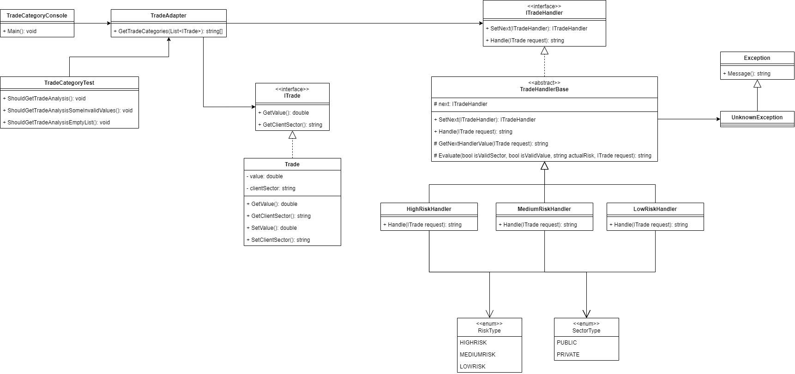

# UBS-Test
An implementation of a challenge with

Input:
```
Trade1 {Value = 2000000; ClientSector = "Private"}
Trade2 {Value = 400000; ClientSector = "Public"}
Trade3 {Value = 500000; ClientSector = "Public"}
Trade4 {Value = 3000000; ClientSector = "Public"}
portfolio = {Trade1, Trade2, Trade3, Trade4}
```

Output:
```
tradeCategories = {"HIGHRISK", "LOWRISK", "LOWRISK", "MEDIUMRISK"}
```

## Preview

Console application output


Unit Tests


Database


## Domain Design


## (T-SQL) Execution:

### Option 1
 run via docker (compose)

 enter T-SQL folder and execute command:
```
docker-compose up -d
```
then open Azure Data Studio to execute the procedures

```
EXEC dbo.insert_all_trades
EXEC dbo.show_all_trades
EXEC dbo.process_trade_categories
EXEC dbo.show_output
EXEC dbo.show_output 1
```

### Option 2

Execute SQL commands from file "T-SQL\database-create.sql" to create, configure and run procedures.

